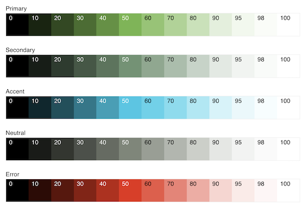
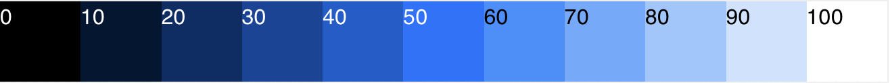
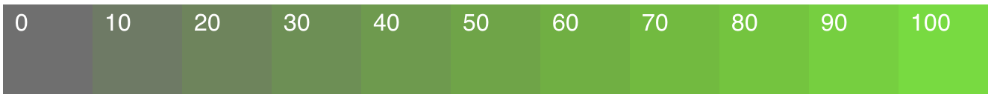
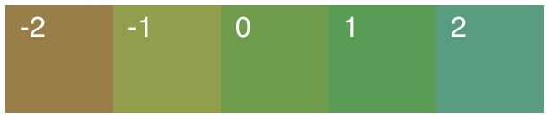
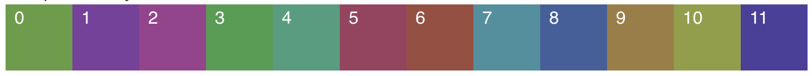
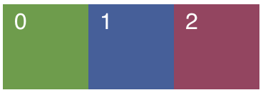

# Simpler Color

[](https://www.npmjs.com/package/simpler-color)
[](https://travis-ci.com/github/arnelenero/simpler-color)
[](https://coveralls.io/github/arnelenero/simpler-color)
[](https://opensource.org/licenses/MIT)

Create your own **complete Web color system** fast and easy, from **as little as one base color**!

Color is at the heart of every UI design system. A cohesive color system enables your application to:

- **consistently** express brand identity and style
- **effectively** communicate intent and meaning

Simpler Color makes it super easy to implement your own CSS-compliant color system for any JavaScript/TypeScript project, no matter what platform, framework, or UI library you are using. It works in the browser, server (Node), mobile (React Native) and desktop (Electron).

## Easy as 1-2-3!

**Step 1:** Install Simpler Color

```
npm install simpler-color
```

**Step 2:** Define your color palettes and their corresponding base colors

```js
const baseColors = {
  primary: '#609E3F',
  secondary: '#5D745D',
  neutral: '#5E5F5A',
  ...etc,
}
```

**—OR—** just give Simpler Color ONE base color, and it will generate the rest!

```js
import { harmony } from 'simpler-color'

// Generate 5 harmonious base colors from your main brand color!
const baseColors = harmony('#609E3F')
```



**Step 3:** Create your color scheme(s) by mapping UI roles to specific colors from the auto-generated palettes

```js
import { colorScheme } from 'simpler-color'

const scheme = colorScheme(
  baseColors, // 👈 From these base colors...
  // 👇 ...your color palettes are auto-generated
  colors => ({
    // 👇 which you then map to UI roles.
    primaryButton: colors.primary(40),
    primaryButtonText: colors.primary(95),
    surface: colors.neutral(98),
    text: colors.neutral(10),
    ...etc,
  }),
)
// Access various UI colors as `scheme.primaryButton` and so on.
```

If some of those terms sound alien to you, read on...

> **BUT FIRST, if you like this library, the concept, and its simplicity, please give it a star ⭐️ on the [GitHub repo](https://github.com/arnelenero/simpler-color) to let me know.** 😀

## Key Concepts

We're not gonna discuss Color Theory here, but let's talk a bit about what a proper color system comprises.

### Color Palette

Creating your color system begins with building your _color palettes_. Each palette consists of a group of related colors, generated from one _base color_.

You decide what sort of relationship should be between colors in the palette. The most common type is the _tonal palette_ (also called _monochromatic_), which is made up of various "tones" of the same general hue. For example, various shades of green is a tonal palette.



Each color in a palette is accessed by a unique _color key_, which is a string or number that indicates its relationship with the base color. The color values are determined by a _color mapping function_, which returns a specific color value for a given color key.

Palettes are automatically created by Simpler Color based on your specified base colors. By default, it generates **tonal** palettes, with specific tones accessed by passing a numeric key between 0 and 100, which represents % _lightness_ (0 = black, 100 = white). Any value in between generates a specific shade of the base color. So, for example, if your `primary` palette is based on green (like in the illustration above), `primary(40)` gives you green with 40% lightness.

You can, of course, define your own color mapping function to override the default. This also means that you can define a completely different set of color keys, which can be any of these common alternatives:

- string values, e.g. 'darker', 'dark', 'base', 'light', 'lighter'
- discrete numeric values, e.g. 0, 10, 20, ..., 90, 95, 98, 100 (like Material Design 3 does)

### Color Set

The _color set_ is simply the collective term for all the color palettes built.

Typically a color set would have a _primary_ palette. This represents the main "brand" color of your app. This is the most prominent hue across your UI.

Common additional palettes can be any of (but not limited to) these:

- _secondary_: less prominent, usually more muted
- _accent_: usually complementary (opposite) to primary, to provide contrast
- _neutral_: typically shades of gray or similar neutral tones
- _error_: normally a brilliant red hue, to indicate errors

To ensure consistency of your color set, Simpler Color enforces that you use the same set of color keys (and thus the same color mapping function) across all your palettes.

### Color Scheme

A color system consists of one or several _color schemes_. These days, it's quite common to implement both Light and Dark color schemes. You can also choose to add some High Contrast schemes for accessibility.

To create a color scheme, you first identify the various _UI roles_ in your design system. Each role indicates a specific use or purpose of color as it applies to specific elements of the UI.

Some common examples of UI role:

- primary button
- primary button text
- surface/background color
- text color

The final step is to map each UI role to a specific color value from one of the palettes in your color set. Each such mapping gives us one color scheme. By using a consistent set of color roles, Simpler Color helps ensure that your UI can easily and safely switch between color schemes.

## Recipes

- [Using the built-in color mapping functions](#built-ins)
  - [Lightness](#lightness)
  - [Saturation](#saturation)
  - [Rotation](#rotation)
  - [Analogue](#analogue)
  - [Complement](#complement)
  - [Triad](#triad)
  - [Opacity](#opacity)
- [Defining a custom color mapping function](#custom-colormap)

<a name="built-ins"></a>

### Using the built-in color mapping functions

Color mapping functions are not only used to generate entire palettes, but also to calculate individual colors, such as palette base colors, based on another. This helps you ensure that base colors for your other palettes are "visually harmonious" with your primary palette's.

The format is always `fn(baseColor, key)` where the valid `key` values vary depending on the function. They can also be nested to perform more complex calculations.

```js
import { analogue, complement, saturation } from 'simpler-color'

const brandColor = '#336699'
const baseColors = {
  primary: brandColor,
  secondary: analogue(brandColor, 2),
  accent: saturation(complement(brandColor, 1), 80),
}
```

Below is the description of each of the built-in color mapping functions:

#### Lightness


```js
lightness(baseColor, percentLightness)
```

Generates a new color value by adjusting the base color's % lightness (the "L" value in HSL color). This is the default color mapping used to generate tonal palettes.

#### Saturation



```js
saturation(baseColor, percentSaturation)
```

Generates a new color value by adjusting the base color's % saturation (the "S" value in HSL color).

#### Rotation


```js
rotation(baseColor, rotationAngle)
```

Rotates the hue of the base color by a specified angle around the color wheel. A negative angle reverses the direction of rotation.

#### Analogue



```js
analogue(baseColor, step)
```

Generates a color that is analogous to the base color. An _analogous_ color is one that is located adjacent to the base color around the color wheel, i.e. at around 30˚ angle. It is visually similar to the base.

This mapping function rotates the hue in steps of 30˚. A negative step value rotates in the opposite direction.

#### Complement



```js
complement(baseColor, step)
```

Generates a color that is complementary to the base color. A _complementary_ color is one that is located at the opposite side of the color wheel, i.e. at 180˚ angle. This provides excellent color contrast.

This mapping function cycles through multiple sets of "double complementary" hue rotation. The algorithm loops from 1 to `step`, rotates Hue by 180˚ on every odd iteration, and 30˚ on even. A negative step value rotates in the opposite direction.

#### Triad



```js
triad(baseColor, step)
```

Generates a triadic complementary color to the base color. A _triadic_ palette consists of 3 colors that are equally spaced around the color wheel. Therefore, producing a triadic complementary color means rotating the hue by 120˚ angle. This provides a more subtle contrast.

This mapping function is cyclic. A negative step value rotates in the opposite direction.

#### Opacity

```js
opacity(baseColor, alpha)
```

Generates a new color value by adjusting the base color's opacity (the alpha or "A" value in RGBA) between 0 (transparent) and 1 (opaque).

[Back to recipes](#recipes)

<a name="custom-colormap"></a>

### Defining a custom color mapping function

Although the default color mapping function already gives you great looking tonal palettes, sometimes your color system might require a different approach, such as:

- a different set of color keys (e.g. strings or discrete numbers)
- a different formula for calculating colors in your palettes

This is where a custom color mapping function comes in. For example, here is a modified version of the default (`lightness`) color mapping function that accepts a string for `key` instead of a number from 0-100.

```js
import { lightness } from 'simpler-color'

function shade(baseColor, key) {
  const lightnessValues = {
    darker: 10,
    dark: 30,
    main: 40,
    light: 60,
    lighter: 80,
  }
  return lightness(baseColor, lightnessValues[key])
}
```

You can then tell Simpler Color to use this custom color mapping instead of the default:

```js
const uiColors = colorScheme(
  'blue',
  colors => ({
    // notice the color keys used   👇
    primaryButton: colors.primary('main'),
    floatingActionButton: colors.accent('light'),
    navBar: colors.secondary('lighter'),
    ...etc,
  }),
  {
    colorMapping: shade, // 👈 custom color mapping
  },
)
```

[Back to recipes](#recipes)
